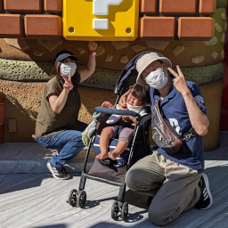
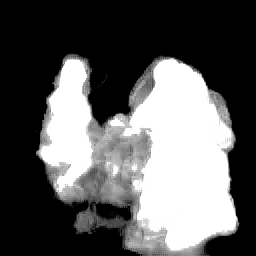

# MediaPipe Selfie Segmentation implemented in PyTorch

## INTRODUCTION

This is a PyTorch implementation of [MediaPipe Selfie Segmentation](https://google.github.io/mediapipe/solutions/selfie_segmentation.html). You can see the network structure through the PyTorch scripts that are helpful to grasp it easily, I believe.

| Input Image | Mask Image   | Masked Image |
|-------------|--------------|--------------|
| |  |  |

## HOW TO TRY

`python demo_static_image.py`

## REFERENCE
- [Searching for MobileNetV3](https://arxiv.org/abs/1905.02244)
