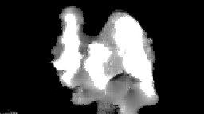
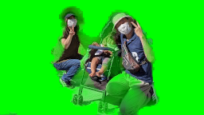
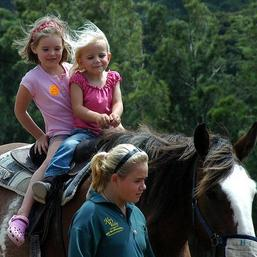
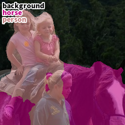
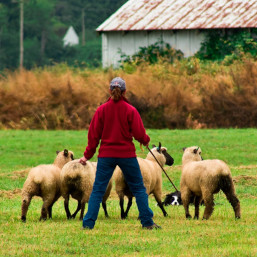
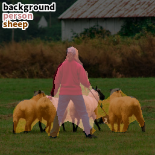

# MediaPipe Image Segmentation implemented in PyTorch

## INTRODUCTION

This is a PyTorch implementation of [MediaPipe Image Segmentation](https://developers.google.com/mediapipe/solutions/vision/image_segmenter/). You can see the network structure through the PyTorch scripts that are helpful to grasp it easily, I believe.

## SAMPLES

### Selfie Segmentation
| Input Image | Mask Image   | Masked Image |
|-------------|--------------|--------------|
| |  |  |
| |  |  |

### Image Segmentation
| Input Image | Segmentation Image |
|-------------|--------------------|
| |  |
| |  |
| |  |

## HOW TO TRY

### Selfie Segmentation
* `$ python demo_selfie_segmentation.py`

### Image Segmentation
* `$ python demo_image_segmentation.py`

### Performance Measurement
* `$ python demo_webcam.py`

## REFERENCE
- [Searching for MobileNetV3](https://arxiv.org/abs/1905.02244)
- [Rethinking Atrous Convolution for Semantic Image Segmentation](https://arxiv.org/abs/1706.05587)
